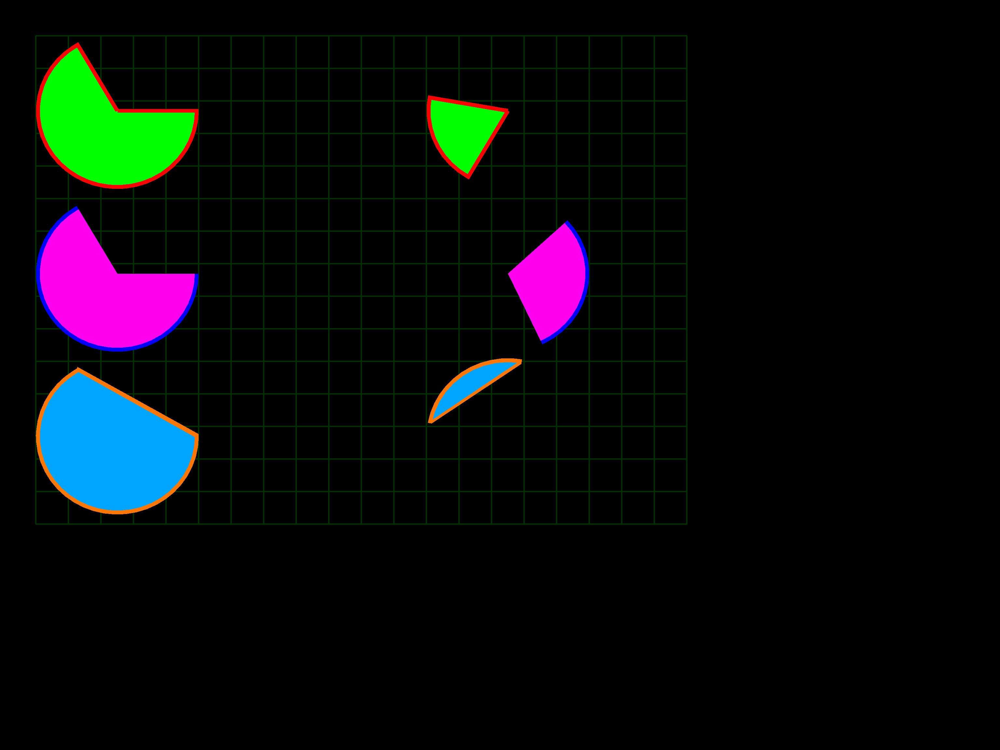
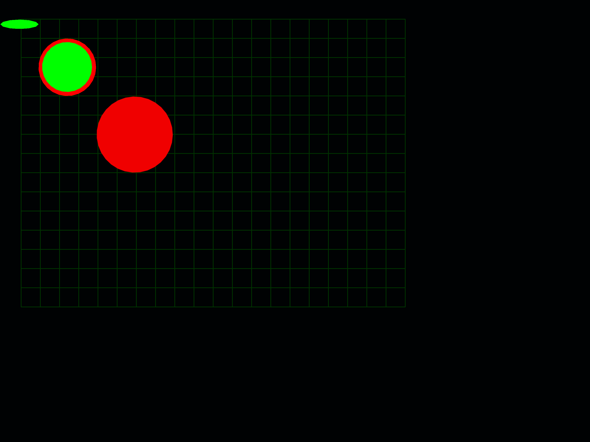
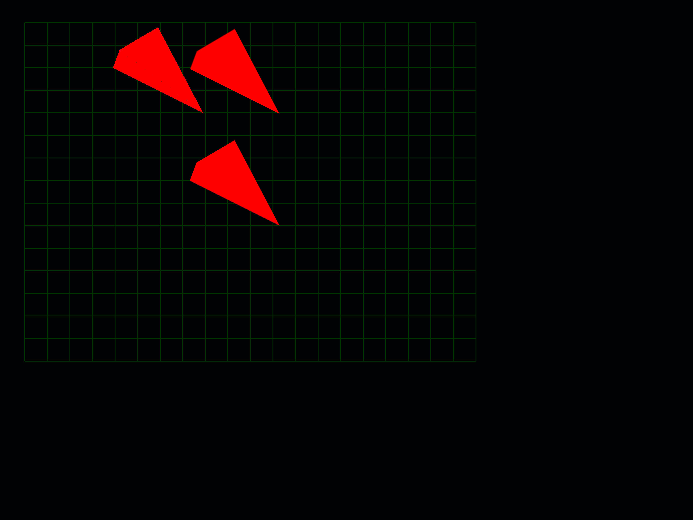

# triangleGML-samples
A samples folder shows XML shapes rendered as pixels in CPU software coded with **Haxe language**.
  
## Generated images
Samples that currently work &check; and samples that need debugging &cross;, or are not wired up &#9888;.
- [Arrow](generatedImages/arc.png) &cross;  
- [Arc](generatedImages/arc.png) &check;  
    
- [Curve](generatedImages/curve.png) &#9888; 
- [Ellipse](generatedImages/ellipse.png) &check;    
    
- [Gradient] &#9888; template sample needed
- [Grid](generatedImages/grid.png) &cross;
- [GlowLine] &#9888; template sample and pixelimageXY required.
- [Line](generatedImages/line.png) &cross;  
- [NineSlice](generatedImages/nineSlice.png) &#9888; Need to integrate reading format extract32 png with pixelimagXY and reading base 64 embed string. 
- [Path](generatedImages/path.png) &#9888; Need to check over path renderer.
- [Pattern](generateImage/pattern.png) &#9888; Lightly to be a mix of pattern shapes. 
- [Picture](generatedImages/picture.png) &#9888; Need to integrate reading format extract32 png with pixelimagXY and reading base 64 embed string.  
- [Poly](generatedImages/poly.png) &#9888;
- [Quad](generatedImages/quad.png) &check;    
    
- [Quint](generatedImages/quint.png) &cross;    
- [Radial](generatedImage/radial.png) &#9888;  
- [Rectangle](generatedImages/rectangle.png) &cross;  
- [Rotate](generatedImages/rotate.png) &#9888;  
- [Skew](generateImages/skew.png) &#9888;  
- [SoftEdge](generateImages/softEdge.png) &#9888;   
- [Star](generateImages/star.png) &#9888; no implementation in pixelimageXY! yet..
- [Text](generateImages/text.png) &#9888; no implementation in pixelimageXY! yet..
- [Thick](generateImages/thick.png) &#9888;  
- [Triangle](generateImages/triangle.png) &#9888;  
- [Ve](generateImages/Ve.png) &#9888;  

Currently the examples are setup for the haxe c++ target to create png's.    
Initially **pixelImageXY** was developed in Haxe Javascript target, rendered on a Canvas.     
In theory pixelimageXY can be used on any Haxe target/toolkit although transfer of pixels may need implementing in some cases.  
**triangleGML** is just a generic abstract class shell. The generics **DRAWTOOL** and **IMAGETOOL** can be implemented by extending the abstact classes with underscore ending names. The **TriangleXML_** class needs extending with a get **getTriangleGML** implementation using a switch statement that returning a shape class from an XML node name. So for instance you can use TriangleGML as a starting point for Canvas implementation.
 
## Dependancies
- https://github.com/nanjizal/triangleGML abstract xml shape parser
- https://github.com/nanjizal/justPath SVG pathData string parser and basic abstract draw API 
- https://github.com/haxeFoundation/format provides PNG saving
- https://github.com/nanjizal/pixelImageXY pixel drawing implementation
  

## **CURRENTLY The relevant dev folders for pixelimageXY and triangleGML have not been commited on github, but need to test render of readme.**